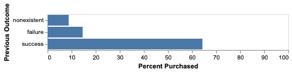
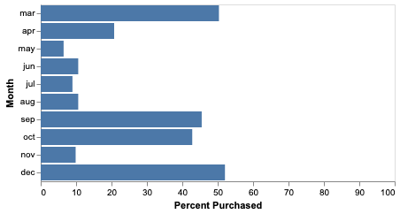
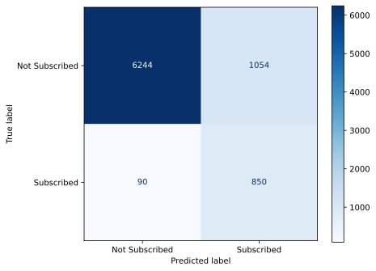
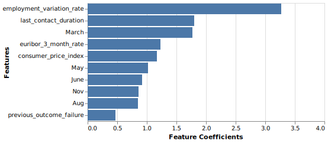

```{r setup, include=FALSE}
knitr::opts_chunk$set(echo = FALSE, fig.align = "center")

library(knitr)
```

# Summary

With a banking institution's telemarketing campaign data, we are attempting to build a classification model to help us identify and pursue customers that will subscribe to a term deposit product. We plan to build a predictive classification model to help us predict customers that will subscribe to the term deposit product.

Our final classification model has reasonable performance on the test data, with a f1-score of 0.6 and a recall score of 0.90. On the 8238 test data cases, we correctly predicted 7091. However, it incorrectly predicted 1147 cases with 1056 being false positives and 91 being false negatives. We were more focused on reducing false negatives to capture more revenue. The false positives are also important as it may require more resources to reach out to potential customers, but our bias was towards revenue (recall).

This model is not sufficient to be used in the industry since the f-1 score still has a lot to improve on. We recommend continuing to improve the classification performance before we use this in production.

# Introduction

Telemarketing is a method of selling products or services to potential customers using the telephone or the Internet and it is commonly used in banks for promotion. Detecting and focusing more on the target customers could have great impact on save time and money [@barich1991framework].

In this project, we investigate if a machine learning algorithm can be used to predict whether a customer will potentially subscribe to the term deposit product. Answering this question is important to bank as they can better estimate potential subscription for the pool of remaining targets, or even for next similar campaign [@moro2014data]. Furthermore, we would also want to identify the key attributes of customers and the nature of the call (e.g. the month, day of the week, contact method) to help the telemarketing team to prioritize resources in calling the higher potential customers and adjusting time and medium for the calls. Therefore, if we can use a classification model to make an accurate and effective prediction, this will be beneficial to expand the bank's value chain to the customer and enhance business demand [@rust2010spotlight].

By doing exploratory analysis, we identified some of the features might be more useful to predict the subscription target. For the categorical features, a couple features looked promising to the model. The "previous outcome" feature seems to be a good candidate as previous success is highly correlated with those subscribing to the term deposit product.

```{r poutcome, echo=FALSE, fig.cap="Figure 1.Distribution of previous outcome features in the training set for subscribers to the bank's term deposit product.", out.width='50%'}

```

In addition, the "month" feature also shows potential. The time of year may impact when term deposit products are more interesting for the customers.

```{r month, echo=FALSE, fig.cap="Figure 2.Distribution of month features in the training set for subscribers to the bank's term deposit product.", out.width = '50%'}

```

For numeric features, we plotted the distributions of each predictor from the training data set and coloured the distribution by different class (did not subscribe: blue and subscribed: orange). Although the distributions for all of these numeric features overlap to a certain degree, they also show a difference in their centers and spreads, for example, employment variation rate, last contact duration, euribor 3 month rate, and consumer price index.

```{r numeric, echo=FALSE, fig.cap="Figure 3.Distribution of numeric features in the training set for subscribers and non-subscribers to the bank's term deposit product.", out.width = '35%', fig.show='hold', fig.align='center'}


knitr::include_graphics(c("../results/consumer_price_index.png", "../results/euribor_3_month_rate.png", "../results/last_contact_duration.png", "../results/employment_variation_rate.png"))


```

# Methods

## Data

The data set used in this project is from from a marketing campaign of a Portuguese bank and created by S. Moro, P. Cortez and P. Rita [@moro2014data]. It was sourced from the UCI Machine Learning Repository [\@ @Dua2019] and can be found [here](https://archive.ics.uci.edu/ml/datasets/Bank+Marketing). Each row in the data set represents summary statistics with detail information of the contacted client, including bank client info (e.g. age, job, loan experience, etc.), other campaign attributes (e.g. number of contact, previous campaign outcome, etc) and social and economic attributes. (e.g. consumer confidence index, euribor rate, etc.) They were using telemarketing to attempt to get customers to sign up for the bank's term deposit product. The target in this dataset is yes or no to subscribing to the term deposit product.

## Analysis

The logistic regression (lr) algorithm was used to build the classification model to predict whether whether a customer will subscribe to the term deposit product (found in the y column of the data set). We used all variables in the original data set to fit the model and carried out cross-validation to choose the hyperparameter C and max_iter with f1-score as the scoring metric. The R and Python programming languages [@R; @Python] and the following R and Python packages were used to perform the analysis: knitr [@knitr], matplotlib [@Hunter], seaborn [@michael_waskom_2017_883859], numpy[@numpy], os[@Python], warnings(McKinney 2019), Pandas [@mckinney-proc-scipy-2010], altair[@Altair2018], docopt [@docoptpython] The code used to perform the analysis and create this report can be found here: <https://github.com/UBC-MDS/DSCI_522_Group_10>

# Results & Discussion

With this first version of the classification model, we included all features in the model. Future versions of this model will include enhancements such as feature elimination to try and improve our results. The model's pipeline first performs simple imputation and other pre-processing such as One Hot Encoder for ordinal and categorical predictors, and standard scaler for numeric predictors before model fitting and hyperparameter optimization.

Our decisions in choosing the model and also hyperparameter optimization was based on the f1_score with a bias towards recall over precision. Based on the cross-validation f1_score, our conclusion was to use the logistic regression (balanced) algorithm. One advantage of this algorithm is that it is very interpretable, allows us to understand feature importance, and easier to communicate to higher level management. We also included class weight balancing to help deal with our class imbalance in this spotting a class problem.

```{r echo=FALSE, warning=FALSE,  results='asis'}
tmp <- URLencode(paste(readLines("../results/model_selection.html"), collapse="\n"))

cat('<p align="center"><iframe src="data:text/html;charset=utf-8,', tmp ,
    '" style="border: none; seamless:seamless; width: 800px; height: 300px"></iframe></p>')
```

Figure 4. Scoring results on the algorithms tested

As a result, we are using Logistic Regression (balanced) with class_weight equal to "balanced" which deals with the class imbalance originally identified in our proposal. Then, we conducted hyperparameter optimization for the parmeters C, the inverse of regularization strength, and max_iter, the maximum number of iterations, by carrying out 5-fold cross-validation. We used the f1-score as our metric of model prediction performance. We observed that the optimal combination of C and max_iter were 1 and 200, respectively. There were also other combinations that also had the same score, so we arbitrarily chose the first one.

```{r echo=FALSE, warning=FALSE, results='asis'}
tmp <- URLencode(paste(readLines("../results/hyperparameter_optimization_result.html"), collapse="\n"))

cat('<p align="center"><iframe src="data:text/html;charset=utf-8,', tmp ,
    '" style="border: none; seamless:seamless; width: 800px; height: 180px"></iframe></p>')
```

Figure 5. Top 5 results from hyperparameter optimization.

Our classification model has reasonable performance on the test data, with a final f1-score of 0.6. As we were focused on minimizing false negatives compared to false positives, as mentioned in the summary, we were using the f1-score as the main metric but had a bias of recall over precision as we focused on capturing as many customers as we can. With the current f1-score, we believe there is more room to improve on this model.

```{r, echo=FALSE, fig.cap="Figure 6. Comfusion matrix on the test result.", out.width = '60%'}

```

From this stage of analysis, we reviewed the features with the top 10 weights identified by the model. They did overlap with the some of features identified in our explanatory data analysis.

```{r, echo=FALSE, fig.cap="Figure 7. Top 10 features identified by model.", out.width = '60%'}

```

To further improve on this model, we can look into the false negatives and false positives to see if we can compare them to the ones that are correctly predicted. From there we can potentially identify features that have more influence on this incorrect prediction and explore different feature engineering techniques to improve our model. We will also spend more effort on feature selection and attempt recursive feature elimination and/or feature selection. In addition to providing the call agents with predictions on whether a customer would potentially subscribe to the term deposit product, we could provide probability estimates for the prediction so the bank's call agents can use their own judgment to whether or not they will spend their time to engage a particular customer. If they are not busy, they may be more willing to contact those with lower probabilities. If they are busy, they can skip particular customers to try and maximize the revenue stream.

# References
