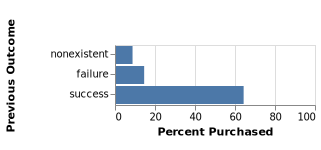
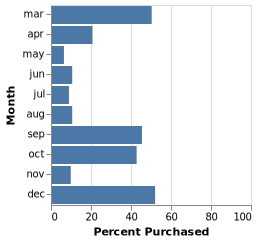
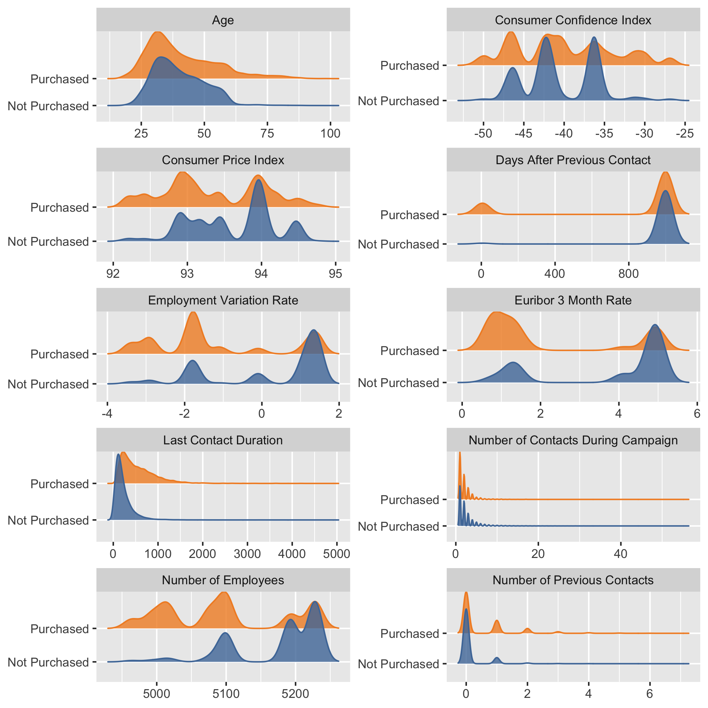

```{r setup, include=FALSE}
knitr::opts_chunk$set(echo = FALSE, fig.align = "center")

library(knitr)
```

# Summary

For this project we are trying to answer the question: given detail records of the this telemarketing campaign outreach, will the contacted customers subscribe to the promoting term deposit product. To answer the predictive question posed above, we plan to build a predictive classification model using logistic regression algorithm. Our final classification model have a reasonable performance on test data, with a final f1-score of 0.6 and an overall accuracy of 0.86. However, this model is not good enough to be used in the industry since the accuray and f-1 score still have a lot to improve. To further improve the classification performance on the model, we will look more closely into the features and do some feature engineering.

# Introduction

Telemarketing is a method of selling products or services to potential customers using the telephone or the Internet and it is commonly used in banks for promotion. Detecting and focusing more on the target customers could have great impact on save time and money [@barich1991framework].

In this project, we ask if a machine learning algorithm can be used to predict whether a newly contacted customer subscribe to the promoting term deposit product. Answering this question is important to bank as they can better estimate potential subscription for the pool of remaining targets, or even for next similar campaign [@moro2014data]. Furthermore, we would also want to identify the key attributes of customers (e.g demographics) and the nature of the call (e.g. the month, day of the week, contact method) to help the tele-marketing team to prioritize resources in calling the higher potential customers and adjusting time and medium for the calling. Therefore, if we can use a machine learning algorithm to make an accurate and effective prediction on whether a newly contacted customer subscribe to the promoting term deposit product, this could may be beneficial to building longer and tighter relations and enhancing business demand [@rust2010spotlight].

By doing exploratory analysis, we noticed that some of the predictors might be useful to predict the subscription target. For the categorical features, some features are similar in the proportion subscribed, while others seem to be promising in predicting the positive class. The poutcome (previous outcome) feature seems to be a good candidate as previous success is highly correlated with the positive class.

```{r poutcome, echo=FALSE, fig.cap="Figure 1.Distribution of previous outcome features in the training set for subscribers to the bank's term deposit product.", out.width = '50%'}

```

In addition, the features values month is also of great possibility to be correlated with the target.

```{r month, echo=FALSE, fig.cap="Figure 2.Distribution of month features in the training set for subscribers to the bank's term deposit product.", out.width = '30%'}

```

For numeric features, we plotted the distributions of each predictor from the training data set and coloured the distribution by different class (didn't subscribe: blue and subscribed: orange). Although the distributions for all of these numeric features overlap to a certain degree, they do show a difference in their centers and spreads, for example, employment variation rate, last contact duration, euribor 3 month rate, and consumer price index.

```{r numeric, echo=FALSE, fig.cap="Figure 3.Distribution of numeric features in the training set for subscribers and non-subscribers to the bank's term deposit product.", out.width = '70%'}

```

# Methods

## Data

The data set used in this project is from from a marketing campaign of a Portuguese bank and created by S. Moro, P. Cortez and P. Rita [@moro2014data]. It was sourced from the UCI Machine Learning Repository [\@ @Dua2019] and can be found [here](https://archive.ics.uci.edu/ml/datasets/Bank+Marketing). Each row in the data set represents summary statistics with detail information of the contacted client, including bank client info (e.g. age, job, loan experience, etc.), other campaign attributes (e.g. number of contact, previous campaign outcome, etc) and social and economic attributes. (e.g. consumer confidence index, euribor rate, etc.) They were using telemarketing to attempt to get customer to sign up for the bank's term deposit product. The target in this dataset is yes or no to subscribing to the term deposit product.

## Analysis

The logistic regression (lr) algorithm was used to build a classification model to predict whether whether a newly contacted customer subscribe to the promoting term deposit product (found in the y column of the data set). We used all variables in the original data set to fit the model and carried out cross-validation to choose the hyperparameter C and max_iter with f1-score as the scoring metric. The R and Python programming languages [@R; @Python] and the following R and Python packages were used to perform the analysis: knitr [@knitr], matplotlib [@Hunter], seaborn [@michael_waskom_2017_883859], numpy[@numpy], os[@Python], warnings(McKinney 2019), Pandas [@mckinney-proc-scipy-2010], altair[@Altair2018], docopt [@docoptpython] The code used to perform the analysis and create this report can be found here: <https://github.com/UBC-MDS/DSCI_522_Group_10>


# Results & Discussion

Since our predictors are mixed with different types of variables and contains unknown values (e.g. education), firstly, we performed simple imputation and other pre-processing such as One Hot Encoder for ordinal and categorical predictors, and standard scaler for numeric predictors before model fitting and hyperparameter optimization. Then, we decided to base our decisions on the f1_score with a bias towards recall over precision and performed randomizedsearchcv to choose a model. Based on the cross-validation f1_score, we got into the conclusion that we chose a simple classification model using the logistic regression (balanced）algorithm. Additionally, this algorithm is very interpretable and easier to communicate to higher level management, and balanced class weight can help to deal with our class imbalance.

```{r echo=FALSE, warning=FALSE,  results='asis'}
tmp <- URLencode(paste(readLines("../result/model_selection.html"), collapse="\n"))

cat('<p align="center"><iframe src="data:text/html;charset=utf-8,', tmp ,
    '" style="border: none; seamless:seamless; width: 800px; height: 280px"></iframe></p>')
```
Figure 4.Scoring on different models.


After that, we did the hyperparameter optimization on C and max_iter by carrying out 5-fold cross-validation and using f1-score as our metric of model prediction performance. We observed that the optimal combination of C C and max_iter were 1 and 1600 respectively..

```{r echo=FALSE, warning=FALSE, results='asis'}
tmp <- URLencode(paste(readLines("../results/hyperparameter_optimization_result.html"), collapse="\n"))

cat('<p align="center"><iframe src="data:text/html;charset=utf-8,', tmp ,
    '" style="border: none; seamless:seamless; width: 800px; height: 180px"></iframe></p>')
```
Figure 5. Results of hyperparameter optimization.

Our classification model have a reasonable performance on test data, with a final f1-score of 0.6 and an overall accuracy of 0.86.
Since we would rather to make the mistakes on classifying the costumers who is actually not going to subscribe into "yes" class than make the mistakes on predicting the costumers who is actually going to subscribe into "no" class, it is acceptable the precision is relatively low with the purpose to maximize recall. However, we think that this model is not good enough to be used in the industry since the accuray and f-1 score still have a lot to improve.

```{r, echo=FALSE, fig.cap="Figure 6. Comfusion matrix on the test result.", out.width = '60%'}
knitr::include_graphics("../results/confusion_matrix.svg")
```
To make a better intepretation on the model, we can look at the the top 10 features identified by model. They seem to overlap with the ones identified in explanatory data analysis, which means the model training is follow our expectation and on the right track.

```{r, echo=FALSE, fig.cap="Figure 7. Top 10 features identified by model.", out.width = '60%'}
knitr::include_graphics("../results/top10_predictors_disregard_direction.svg")
```

To further improve the classification performance on the model, instead of focusing on choosing the best model, we will look more closely into the features and do some feature engineering. For example, we can use the recursive feature elimination (RFE) to eliminate unimportant features or we can use search and score to  select the only the important features.

# References
